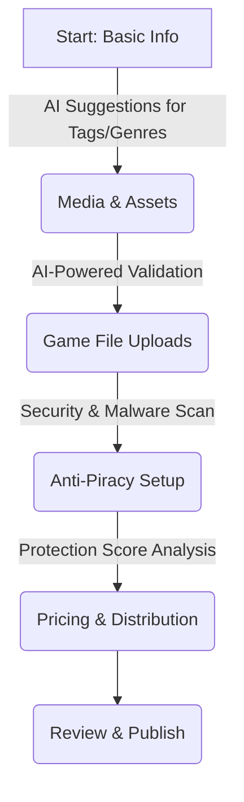
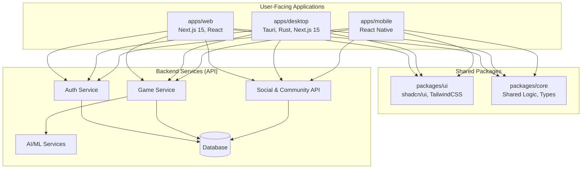

# 酸化 (Oxide)

**Redefining the Digital Gaming Ecosystem.**

[](https://github.com/byronwade/Oxide)
[](./LICENSE)
[](./package.json)
[](CONTRIBUTING.md)

---

## Table of Contents

1.  [**Executive Summary**](#executive-summary-a-new-paradigm-in-gaming)
2.  [**The Oxide Vision**](#the-oxide-vision-beyond-a-launcher)
3.  [**Core Differentiators: The Four Pillars**](#core-differentiators-the-four-pillars-of-oxide)
    -   [Pillar 1: Player Experience & Discovery](#pillar-1-redefining-the-player-experience--discovery)
    -   [Pillar 2: Creator & Community Ecosystem](#pillar-2-empowering-creators--communities)
    -   [Pillar 3: Economic Models & Digital Ownership](#pillar-3-innovative-economic-models--digital-ownership)
    -   [Pillar 4: Uncompromising Technical Excellence](#pillar-4-uncompromising-technical-excellence)
4.  [**Technical Architecture Deep Dive**](#technical-architecture-deep-dive)
    -   [High-Level Architecture Diagram](#high-level-architecture)
    -   [The Oxide Tech Stack](#the-oxide-tech-stack)
    -   [Monorepo Strategy (Turborepo + Bun)](#monorepo-strategy-turborepo--bun)
    -   [Application Breakdown](#application-breakdown)
5.  [**Feature Roadmap**](#feature-roadmap)
6.  [**Design Philosophy**](#design-philosophy)
7.  [**Getting Started**](#getting-started)
8.  [**Contributing**](#contributing)
9.  [**License**](#license)

---

## Executive Summary: A New Paradigm in Gaming

The contemporary gaming landscape is dominated by legacy platforms, characterized by intense competition and rapidly evolving player and developer expectations. For a new platform to achieve significant market differentiation, it must transcend the conventional approach of offering isolated features. Instead, market leadership necessitates a holistic, interconnected value proposition that systematically addresses the deeply-rooted pain points for both players and developers.

**Oxide** is a next-generation gaming platform engineered from the ground up to be that leader. It is not merely a launcher or a storefront; it is a cohesive ecosystem designed for the future of digital interaction. This document outlines the strategic framework for Oxide, emphasizing a multi-faceted approach across player experience, creator empowerment, innovative economic models, and technical excellence. By integrating advanced functionalities into a synergistic offering, Oxide will establish a robust competitive advantage and redefine the digital gaming ecosystem.

---

## The Oxide Vision: Beyond a Launcher

Our mission is to create the most developer-friendly and player-focused gaming platform in the world. We believe that the current market leaders have become complacent, prioritizing their walled gardens over the needs of the communities that give them value.

**For Players**, Oxide will be a portal to hyper-personalized, seamless, and instant gaming experiences. A place where discovering a new favorite game feels magical, not algorithmic. A place where their library is truly theirs, and their engagement is respected and rewarded.

**For Developers**, Oxide will be a transparent partner. A platform that provides powerful, accessible tools to build, ship, and manage games without punitive revenue sharing or opaque discovery mechanisms. We empower creators with superior analytics, advanced anti-piracy, and a direct line to their community.

We are building a platform that is:
-   **Faster:** Sub-200ms interactions and optimized content delivery.
-   **More Open:** A commitment to DRM-optional policies and a powerful, public-facing API.
-   **Fairer:** A developer-first revenue model and transparent systems.
-   **Smarter:** AI-enhanced features at every level of the ecosystem.

---

## Core Differentiators: The Four Pillars of Oxide

Oxide's strategy is built upon four foundational pillars designed to create a virtuous cycle of engagement, creation, and monetization.

| Pillar                               | Key Differentiator                                        | Impact on Ecosystem                                                                                                           |
| ------------------------------------ | --------------------------------------------------------- | ----------------------------------------------------------------------------------------------------------------------------- |
| **Player Experience & Discovery**    | Hyper-Personalized Journeys via AI & Unified Access       | Enhances engagement, reduces churn, fosters seamless play across devices, and broadens accessibility.                       |
| **Creator & Community Ecosystem**    | Empowered Content Creation & Community-Driven Evolution | Stimulates a continuous flow of unique, high-quality content, fosters deep player investment, and ensures a collaborative environment. |
| **Economic Models & Digital Ownership** | Dynamic Monetization & True Digital Asset Ownership     | Maximizes revenue for creators, offers unprecedented player control over assets, and unlocks new economic opportunities.       |
| **Technical Excellence**             | Superior Content Delivery & High-Performance Architecture | Ensures reliability, speed, and responsiveness, minimizing friction for downloads, updates, and overall platform interaction. |

### Pillar 1: Redefining the Player Experience & Discovery

To distinguish itself, Oxide must move beyond conventional game discovery and deliver deeply personalized, seamless, and instant player experiences across all devices.

#### **Hyper-Personalized Journeys: AI-Driven Discovery & Dynamic Content**
Traditional game discovery often relies on broad, impersonal algorithms, leading to user fatigue and limited exposure for diverse titles. Artificial Intelligence (AI) offers a transformative path to genuinely tailor the gaming experience.

Oxide's AI-driven personalization leverages a suite of intelligent models to adapt game content, difficulty, and interactions to individual players. This sophisticated approach can **increase player engagement by up to 30%**, reduce churn, and optimize monetization strategies.

*   **Behavioral Analysis Engine:** Continuously and privately analyzes gameplay patterns to understand player skill, preferences, and mood.
*   **Dynamic Content Generation:** Works with game developers to enable AI-powered in-game events, adaptive difficulty, and personalized challenges.
*   **"Intelligent Discovery" Feed:** Replaces the static store page with a dynamic, personalized feed of games, mods, community content, and news that is uniquely relevant to each user.

#### **Unified Cross-Platform Access**
Play should be seamless. Oxide's architecture ensures a consistent and synchronized experience across Web, Desktop, and Mobile platforms.

*   **Cloud-First State Sync:** All library data, game states, and user settings are synchronized in real-time. Start a download on your desktop and monitor it from your phone.
*   **Native Performance:** The Tauri-based desktop client provides a high-performance, low-resource-usage application that feels integrated with the host OS, a stark contrast to the web-wrapper feel of competing launchers.

#### **Performance-First User Experience**
Speed is a feature. Every interaction on the Oxide platform, from booting the launcher to browsing the store, is engineered to be faster than any competitor.

*   **Sub-200ms Interaction Time:** A non-negotiable performance budget for all UI interactions.
*   **Optimized Core Web Vitals:** Our web platform is built to score >95 on Google Lighthouse, ensuring excellent SEO and a snappy user experience.
*   **Efficient Local Caching:** The desktop client intelligently caches library data, images, and metadata for instant-on access.

### Pillar 2: Empowering Creators & Communities

A thriving platform is built on the creativity of its community. Oxide is architected to empower developers and content creators with cutting-edge tools and a fair, transparent ecosystem.

#### **The Developer Upload & Management Workflow**
We have streamlined the game submission process into a simple, AI-enhanced wizard.



*   **Advanced Anti-Piracy:** We offer multi-tiered, AI-powered content protection, including digital fingerprinting and real-time monitoring, giving developers peace of mind.
*   **Rich Analytics Dashboard:** Developers get deep, actionable insights into player behavior, game performance, and market trends, far exceeding the basic stats offered by other platforms.
*   **Integrated Modding Support:** A first-class modding ecosystem encourages community content creation, extending the life and value of games. Our client includes built-in mod management with dependency resolution and conflict detection.

### Pillar 3: Innovative Economic Models & Digital Ownership

Oxide introduces flexible and powerful economic models that benefit both developers and players.

*   **Dynamic Monetization:** We support numerous models out-of-the-box: one-time purchases, subscriptions, free-to-play with IAPs, and developer-defined in-game economies, all managed through the Oxide dashboard.
*   **Aggressive Revenue Share:** We offer a **95/5 revenue split** in favor of the developer. We only make money when you do.
*   **True Digital Asset Ownership:** We are architecting a future where players have true, verifiable ownership of their digital assets, creating new opportunities for trading and community-driven economies, moving beyond the limitations of traditional, restrictive licenses.

### Pillar 4: Uncompromising Technical Excellence

Speed, reliability, and performance are the bedrock of the Oxide experience.

*   **Blazing Fast, Everywhere:** Using a modern tech stack including **Rust, Next.js 15, and Turborepo**, Oxide is engineered for elite performance.
*   **API-First Design:** The entire platform is built on our own powerful public API. What we use to build Oxide, developers can use to extend it. This API is designed to surpass the feature set and reliability of any competitor.
*   **Optimized Content Delivery:** An intelligent, global content delivery network ensures that game downloads and updates are faster and more reliable. We use peer-to-peer technology (securely and with user permission) to accelerate large downloads for popular titles.

---

## Technical Architecture Deep Dive

### High-Level Architecture



### The Oxide Tech Stack

| Category      | Technology                                    | Rationale                                                                |
| ------------- | --------------------------------------------- | ------------------------------------------------------------------------ |
| **Monorepo**  | Turborepo, Bun                                | High-performance builds, code sharing, and simplified dependency management. |
| **Web App**     | Next.js 15, React Server Components, TypeScript | Speed, SEO, modern React features, and type safety.                      |
| **Desktop App** | Tauri, Rust, Next.js 15                         | Secure, cross-platform, high-performance native shell with a web frontend. |
| **Mobile App**  | React Native                                  | Cross-platform mobile development with shared logic from the ecosystem.  |
| **Styling**     | Tailwind CSS, shadcn/ui                       | Utility-first CSS for rapid development and a consistent design system.  |
| **Backend**     | Rust (for native components), Node.js (for API) | Performance and safety (Rust), and a large ecosystem for web services (Node). |
| **Database**    | PostgreSQL                                    | Robust, scalable, and reliable relational database.                      |

### Monorepo Strategy (Turborepo + Bun)
The choice of a monorepo architecture is a strategic one, aimed at maximizing development velocity and ensuring consistency across our entire platform.
-   **`apps/web`**: The main web platform, built with Next.js 15. It features a marketing site, developer dashboard, and the web-based game store.
-   **`apps/desktop`**: The native desktop client, built with Tauri and Rust. It provides a high-performance application for game management, local library indexing, and offline play.
-   **`apps/mobile`**: An experimental mobile application built with React Native.
-   **`packages/ui`**: A shared component library based on shadcn/ui, ensuring a consistent design system.
-   **`packages/core`**: Shared business logic, types, and utilities used across the entire platform.

### Application Breakdown
- **Web**: The primary entry point for new users and developers. It is optimized for discovery and onboarding.
- **Desktop**: The power-user experience. It's where players manage their libraries, play games, and interact with the community. Its Rust backend allows for powerful features like filesystem indexing and native-speed operations.

---

## Feature Roadmap

### Q3 2024: Foundation & Launch
-   [x] Core Platform Architecture
-   [x] Web & Desktop Clients
-   [x] Developer Game Upload & Management
-   [x] Basic AI-Driven Discovery
-   [ ] Public Launch

### Q4 2024: Community & Social
-   [ ] Advanced Social Features (Feeds, Groups)
-   [ ] Integrated Modding Platform
-   [ ] Real-time Chat & Presence
-   [ ] Public Developer API (v1)

### Q1 2025: Economy & Personalization
-   [ ] Advanced Monetization Models
-   [ ] Player-to-Player Trading (Alpha)
-   [ ] Dynamic In-Game AI Content
-   [ ] Expanded SDKs for Developers

---

## Design Philosophy

Our design is guided by a simple principle: **minimalistic, UX-first design with a black and rust theme.** Inspired by Vercel's design language, every interface must be retina-ready and feel native while incorporating AI seamlessly. Performance and clarity are prioritized over decorative flair.

---

## Getting Started

1.  **Clone the repository:**
    ```bash
    git clone https://github.com/byronwade/Oxide.git
    cd Oxide
    ```
2.  **Install dependencies:**
    ```bash
    bun install
    ```
3.  **Run the development servers:**
    ```bash
    bun dev
    ```

This will launch the web application on `http://localhost:3000` and the desktop application's web view on `http://localhost:3001`.

To build and run the native desktop application, navigate to its directory and use the Tauri CLI:
```bash
cd apps/desktop
bun tauri dev
```

---

## Contributing
We welcome contributions from the community! Please read our [CONTRIBUTING.md](./CONTRIBUTING.md) for details on our code of conduct, and the process for submitting pull requests to us.

---

## License
This project is licensed under the MIT License - see the [LICENSE.md](./LICENSE.md) file for details. 